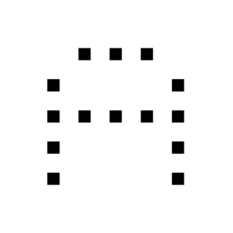
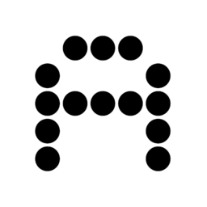
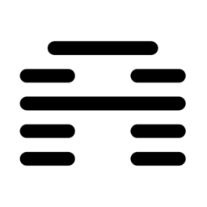
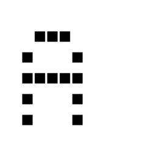
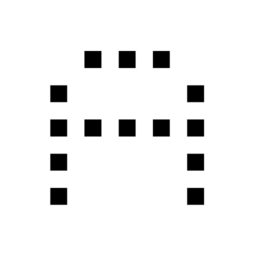
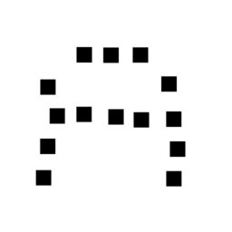

# bdf2ufo

Converts `.bdf` pixel fonts to `.ufo` static and variable vector fonts.

## Features

* **Automated Font Generation**: Creates both static and variable fonts.
* **Variable Font Axes Support**: Supports five axes for pixel manipulation:
  * **Element Size (ESIZ)**
  * **Roundness (ROND)**
  * **Bleed (BLED)**
  * **Horizontal Element Spacing (XESP)**
  * **Element Jitter (EJIT)**

  These allow you to simulate the visual characteristics of LCD screens, CRT monitors and dot matrix printer printouts.

* **Element Composition**: Composites characters from a pixel glyph to reduce font size.
* **Glyph Decomposition**: Automatically decomposes composed characters for further size reduction.
* **Anchor Creation**:  Automatically adds base-to-mark anchors.

## Examples

* **[Tiny5](https://github.com/Gissio/font_Tiny5)**
* **[DotMatrix](https://github.com/Gissio/font_DotMatrix)**

## Axes

| Axis | Description                | Small                                    | Large                                    |
| ---- | -------------------------- | ---------------------------------------- | ---------------------------------------- |
| ESIZ | Element Size               |  |  |
| ROND | Roundness                  |  |  |
| BLED | Bleed                      |  |  |
| XESP | Horizontal Element Spacing |  |  |
| EJIT | Element Jitter             |  |  |

## Building a font

1. **Convert Source Font**
   * If your font is in `.ttf` or `.otf`, first convert to `.bdf`. You can use `otf2bdf`:
     * macOS: Install via [Homebrew](https://brew.sh/): `brew install otf2bdf`
     * Ubuntu: `sudo apt install otf2bdf`
     * Windows: Download from [here](http://sofia.nmsu.edu/~mleisher/Software/otf2bdf/).

2. **Setup Environment**:
   * Ensure [Python](https://www.python.org/) and [pip](https://pip.pypa.io/en/stable/installation/) are installed.

3. **Install Dependencies**:
   * Run `pip install -r requirements.txt`

4. **Prepare Master Directory**:
   * Create an empty folder to hold your `.ufo` master files.

5. **Run bdf2ufo**:
   * For usage help, execute:

        python tools/bdf2ufo.py --help

6. **Compile .ufo files**:
   * Use `gftools`:

        gftools builder [masters-path]/[family-name]-config.yaml

## Tips

* **Verbose Output**: Use `--verbose` for detailed conversion logs.
* **Glyph Alignment**: Adjust glyph centering with `--glyph-offset-x`; supports fractional values.
* **Jitter Effect**: Set `EJIT` to around 0.05 for a subtle jitter with Gaussian distribution.
* **Axes Limits**: Adjust the axes limits with `--axis-limits`.
* **Bold Effect**: Use `--double-stroke` to enhance boldness by doubling elements with a 0.5 vertical offset.
* **Static Fonts**: Omit `--variable-axis` and `--variable-instance`, and use `--static-axes` to define axis values.
* **Combining Characters**: Undefined characters from U+0300 to U+036F are automatically copied from similar defined glyphs.
* **Combining Alternatives**: `bdf2ufo` looks for both combining characters and modifiers to decompose composed characters, allowing for alternates.
* **Anchor Positioning**: Anchors are placed at the bottom-center of glyphs.

## Additional Resources

* **[Bits'N'Picas](https://github.com/kreativekorp/bitsnpicas)**: A bitmap font editor.
* **[FontDrop!](https://fontdrop.info/)**: An online glyph viewer.
* **[Hyperglot](https://hyperglot.rosettatype.com/)**: Glyph database and font language support checker.
* **[The Font Testing Page](https://www.impallari.com/testing/)**: A Drag-and-Drop webpage for testing fonts.
* **[SYMBL](https://symbl.cc/)**: An online glyph search tool.
