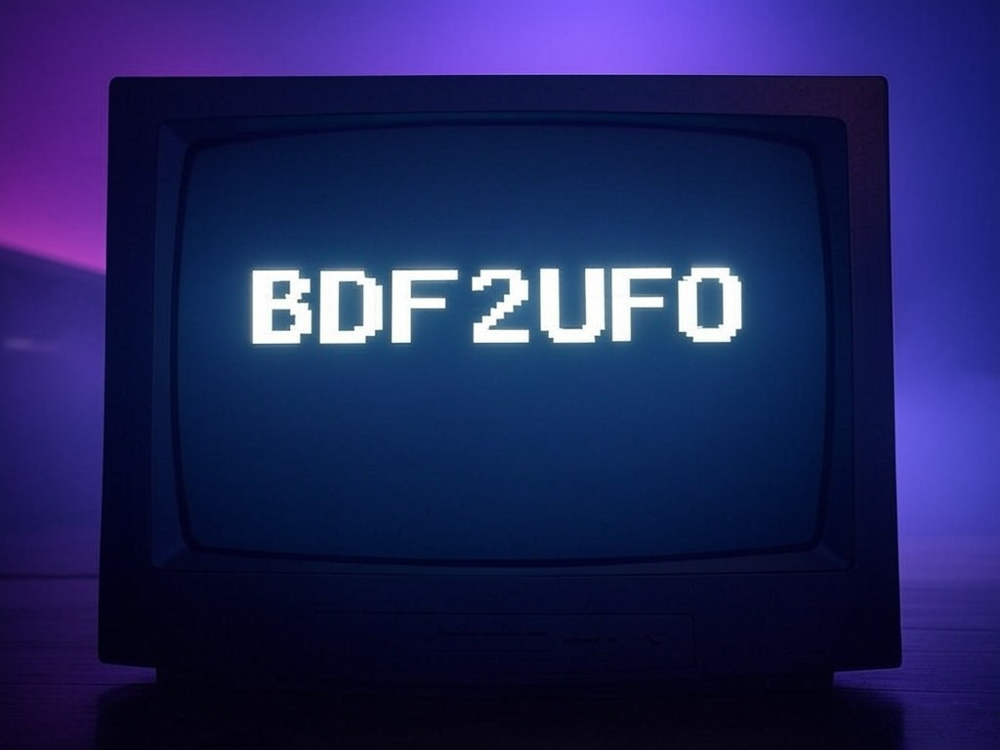

 

# bdf2ufo

Converts .bdf pixel fonts to .ufo static and variable vector fonts.

## Features

* Automatically creates static and variable fonts.
* Supports three variable axes: pixel volume, roundness and bleed, simulating the appearance of LCD screens, CRT monitors and dot matrix printouts.
* Automatically decomposes glyphs, reducing font size.
* Automatically adds anchors.

## Examples

* Check the [fonts](fonts) folder!

## Building a font

1. If your source font is in .ttf or .otf vector format, convert it first to the .bdf pixel format. You can use the `otf2bdf` converter available at http://sofia.nmsu.edu/~mleisher/Software/otf2bdf/. Under macOS, install with [Homebrew](https://brew.sh/). Under Ubuntu, install with this command: `sudo apt install otf2bdf`.
2. Make sure [Python](https://www.python.org/) and [pip](https://pip.pypa.io/en/stable/installation/) are installed.
3. Install the bdf2ufo requirements: `pip install -r requirements.txt`
4. Create an empty folder for storing the .ufo designspace.
5. Run bdf2ufo with the appropriate options. For usage help, try:

    python tools/bdf2ufo.py --help

6. Compile the .ufo designspace:

    gftools builder config.yaml

## Additional resources

* [Bits'N'Picas](https://github.com/kreativekorp/bitsnpicas): bitmap font editor
* [FontDrop!](https://fontdrop.info/): online glyph viewer
* [Oh My Glyph](https://www.ohmyglyph.com/): online glyph copy+paste
