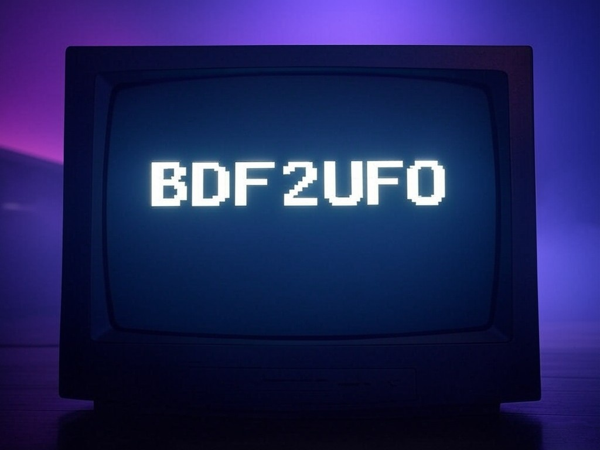
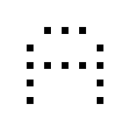
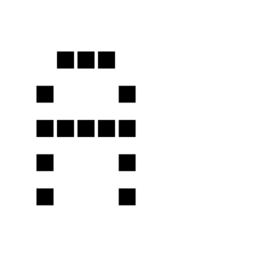
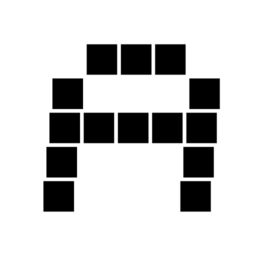
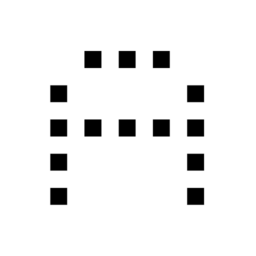

# bdf2ufo

**bdf2ufo** is a tool for converting `.bdf` bitmap fonts into `.ufo` sources, enabling the creation of both **static** and **variable** vector fonts.

It bridges the gap between classic pixel-based design and modern font production workflows—making it easy to bring legacy bitmap fonts into contemporary type systems.

## Features

### Variable Font Axes

bdf2ufo provides built-in support for six expressive axes tailored to pixel typography:

* **Weight (`wght`)**
* **Width (`wdth`)**
* **Slant (`slnt`)**
* **Roundness (`ROND`)**
* **Bleed (`BLED`)**
* **Jitter (`JITT`)**

These axes allow you to simulate the rendering quirks of historical display technologies such as **LCD screens**, **CRT monitors**, and **dot matrix printers**, while remaining fully compatible with modern OpenType variable font workflows.

### Smart Glyph Construction

* **Element Glyph System**
  Reuses a base “element” glyph to construct characters efficiently, reducing file size and complexity.

* **Automatic Decomposition**
  Decomposes composite glyphs when needed for better compatibility and editing.

* **Anchor Generation**
  Automatically adds:

  * base-to-mark anchors
  * mark-to-mark anchors

## Axes overview

| Tag  | Name      | Small                                    | Large                                    |
| ---- | --------- | ---------------------------------------- | ---------------------------------------- |
| wght | Weight    |  |  |
| wdth | Width     |   |  |
| slnt | Slant     |    |   |
| ROND | Roundness |    |  |
| BLED | Bleed     |    |  |
| EJIT | Jitter    |    |  |

## Getting Started

### 1. Convert your source font (if needed)

If your font is in `.ttf` or `.otf`, convert it to `.bdf` using `otf2bdf`:

* **macOS (Homebrew)**

  ```bash
  brew install otf2bdf
  ```

* **Ubuntu**

  ```bash
  sudo apt install otf2bdf
  ```

* **Windows**
  Download from: [http://sofia.nmsu.edu/~mleisher/Software/otf2bdf/](http://sofia.nmsu.edu/~mleisher/Software/otf2bdf/)

### 2. Set up your environment

Make sure you have:

* Python
* pip

Install dependencies:

```bash
pip install -r requirements.txt
```

### 3. Prepare your project

* Create an empty directory for your `.ufo` masters
* Review the example config:
  `sources/PressStart2P/PressStart2P-build-config.yaml`

### 4. Run bdf2ufo

View CLI usage:

```bash
python -m scripts.bdf2ufo.cli
```

### 5. Build your fonts

Create a `config.yaml` in your masters directory, then compile using:

```bash
gftools builder [masters-path]/config.yaml
```

## Fonts using bdf2ufo

* **Tiny5**
  [https://github.com/Gissio/font_Tiny5](https://github.com/Gissio/font_Tiny5)

* **DotMatrix**
  [https://github.com/Gissio/font_DotMatrix](https://github.com/Gissio/font_DotMatrix)

## Additional Resources

* **Bits'N'Picas** – Bitmap font editor
  [https://github.com/kreativekorp/bitsnpicas](https://github.com/kreativekorp/bitsnpicas)

* **FontDrop!** – Online font inspector
  [https://fontdrop.info/](https://fontdrop.info/)

* **Fontspector** – Visual font QA and reporting tool
  [https://fonttools.github.io/fontspector/](https://fonttools.github.io/fontspector/)

* **The Font Testing Page** – Browser-based font testing
  [https://www.impallari.com/testing/](https://www.impallari.com/testing/)

* **Shaperglot** – Language support checker
  [https://googlefonts.github.io/shaperglot/](https://googlefonts.github.io/shaperglot/)

* **Hyperglot** – Language support checker
  [https://hyperglot.rosettatype.com/](https://hyperglot.rosettatype.com/)

* **What Unicode character is this?** – Identify Unicode characters by symbol, code point, or name
  [https://www.babelstone.co.uk/Unicode/whatisit.html](https://www.babelstone.co.uk/Unicode/whatisit.html)

* **SYMBL** – Unicode character reference
  [https://symbl.cc/](https://symbl.cc/)

* **Combining characters** – Easy access to combining Unicode marks
  [https://sheeptester.github.io/javascripts/combining.html](https://sheeptester.github.io/javascripts/combining.html)